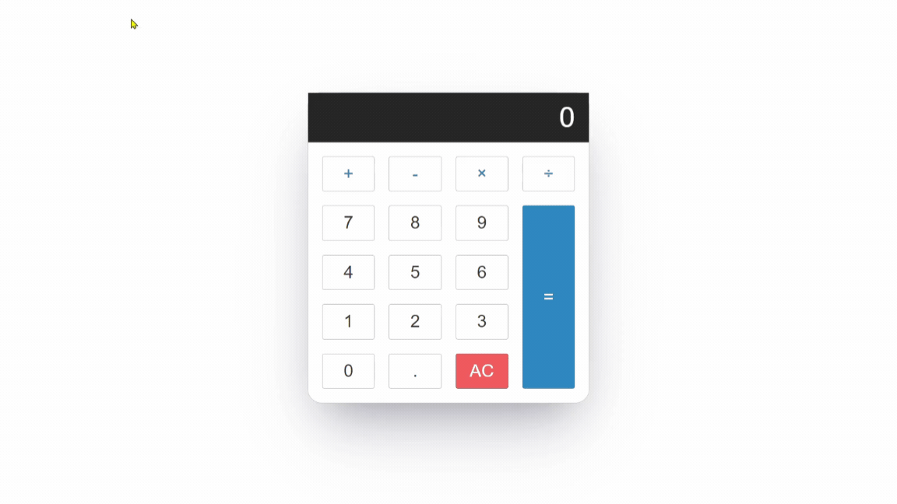

# Calculator

This project aims to create a simple calculator using JavaScript. It is developed with HTML, CSS, and JavaScript.

## Features

- Ability to perform addition, subtraction, multiplication, and division operations.
- Support for decimal numbers and negative numbers.
- Reset function (AC) to clear the calculation.
- User-friendly interface.

## Gif

